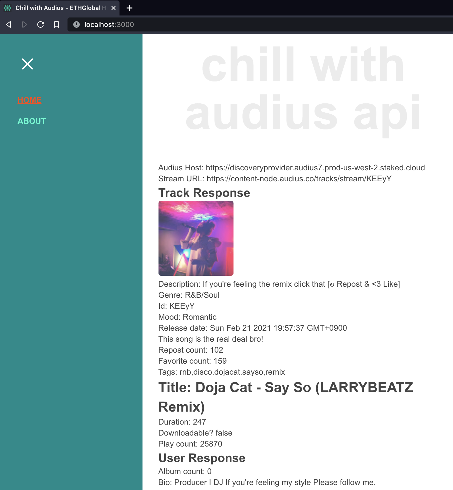

# Chill with Audius

My project for [ETHGlobal](https://ethglobal.co/) HackFS 2021 Hackathon!

Just playing around with the [Audius API](https://audiusproject.github.io/api-docs/#audius-api-docs) at this point.

My idea is to present a couple of genres and based on the selection present information from Wikipedia along with dynamically changed styles.

## Screenshot

